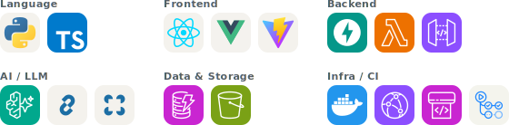

# t-act

Takuto Motoki — software engineer in Japan.

修士（物理）で核融合プラズマの実験データ解析に取り組んだのち、現在はソフトウェアエンジニアとして既存プロダクトへのAIエージェント機能追加の開発に従事。

## Main Repositories

| リポジトリ | 概要 |
|-----------|------|
| [quil](https://github.com/t-act/quil) | GitHubリポジトリのMarkdownをブラウザから直接編集・コミットできるWebアプリ。OAuth認証、暗号化Cookieによるステートレスセッション管理、IaC・CI/CDまで一貫して構築 |
| [til](https://github.com/t-act/til) | 毎日の学習記録。継続を仕組みで支えるコミットリマインダーをGitHub Actionsで自作 |
| [cmap](https://github.com/t-act/cmap) | 修士研究で開発した磁気面再構成コード。磁気センサーの計測値からプラズマ内部状態を推定する逆問題を反復最適化で解く |

  <a href="https://skillicons.dev">
    <picture>
      <source media="(prefers-color-scheme: dark)" srcset="assets/skills-dark.svg">
      
    </picture>
  </a>

