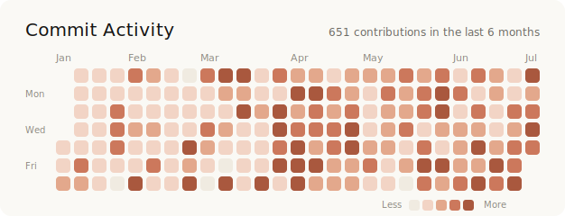

# t-act

Hi there. I'm Takuto Motoki, a software engineer from Japan.

  <picture>
    <source media="(prefers-color-scheme: dark)" srcset="assets/activity-dark.svg">
    
  </picture>

## 経歴

- 修士（物理）：核融合プラズマの実験データ解析
- 現在：ソフトウェアエンジニアとして、既存プロダクトへのAIエージェント機能追加の開発に従事

## 技術スタック

  <a href="https://skillicons.dev">
    <picture>
      <source media="(prefers-color-scheme: dark)" srcset="https://skillicons.dev/icons?i=py,ts,react,vue,fastapi,aws,docker,githubactions&theme=dark">
      
    </picture>
  </a>

## 主なリポジトリ

| リポジトリ | 概要 | 技術 |
|-----------|------|------|
| [quil](https://github.com/t-act/quil) | GitHubリポジトリのMarkdownをブラウザから直接編集・コミットできるWebアプリ。OAuth認証、暗号化Cookieによるステートレスセッション管理、IaC・CI/CDまで一貫して構築 | React / TypeScript / FastAPI / AWS (Lambda, CloudFront) |
| [til](https://github.com/t-act/til) | 毎日の学習記録。継続を仕組みで支えるコミットリマインダーをGitHub Actionsで自作 | Markdown / GitHub Actions |
| [cmap](https://github.com/t-act/cmap) | 修士研究で開発した磁気面再構成コード。磁気センサーの計測値からプラズマ内部状態を推定する逆問題を反復最適化で解く | Python / NumPy |

## 学習と実験

- **深層学習・LLMの基礎**：『ゼロから作るDeep Learning』1・2・6巻（[1](https://github.com/t-act/deep-learning-from-scratch) / [2](https://github.com/t-act/deep-learning-2) / [6](https://github.com/t-act/deep-learning-6)）、『大規模言語モデル入門』（[intro-llm](https://github.com/t-act/intro-llm)）を実装しながら学習
- **LLMアプリケーション**：RAG、LangChain / LangGraph、MCPサーバー、ファインチューニング、ローカルLLMの実験
- **アルゴリズム**：[AtCoder](https://github.com/t-act/atcoder-training) で競技プログラミングに取り組み中

